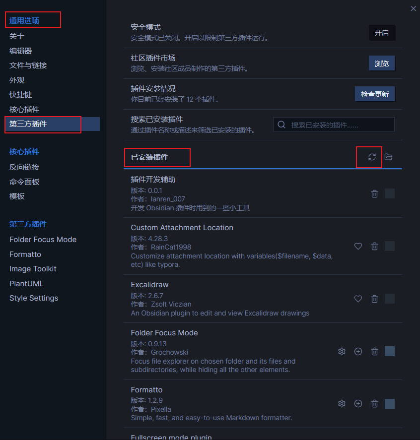

# 时光日志

Obsidian 插件。

像记账一样记录每日的工作内容。

## 安装方式

### 下载插件

### 安装插件

将 obsidian-timelog.zip 解压，解压后的目录结构如下：

- obsidian-timelog/
  - manifest.json
  - main.js
  - styles.css

将 obsidian-timelog 移动到 Obsidian 插件目录，移动后的目录结构如下

- 您的Obsidian仓库/.obsidian/plugins/
  - obsidian-timelog/
    - manifest.json
    - main.js
    - styles.css

### 启用插件

进入 Obsidian 设置，左侧列表【通用选项】-【第三方插件】，右侧详情【已安装插件】，点击刷新图标【重新加载插件】，找到 Timelog 并启用。

## 使用方式

### 新建时光日志

### 新建计划

### 计划管理
